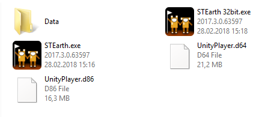

# Instructions for making 32/64bit dual Windows build for Unity 2017.1 and up

  * Make win64 build of your game, this will be your working folder
  * Rename data folder to "Data"
  * Rename UnityEngine.dll to UnityEngine.d64
  * If using mono 2.0 rename "Data\Mono\mono.dll"->"Data\Mono\mono.d64"
  * If using mono 4.6 rename Rename "Data\MonoBleedingEdge\EmbedRuntime\mono-2.0-bdwgc.dll"->"Data\MonoBleedingEdge\EmbedRuntime\mono-2.0-bdwgc.d64"
    
  * Make win32 build of your game
  * Copy win32 exe into working folder so that it has different name from 64bit exe file (like "Game32.exe")
  * Copy win32 UnityEngine.dll into working folder with name UnityEngine.d86
  * Copy win32 Mono DLL from data folder into working folder just like before, but now with ".d86" extension
	
  * Open UnityEngine.d64 with hex editor or text editor that can handle binary files (like Notepad++)
  * Search and replace "mono.dll" with "mono.d64"
  * Search and replace "mono-2.0-bdwgc.dll" with "mono-2.0-bdwgc.d64"
  * Open UnityEngine.d86 and repeat for d86 extension ("mono.dll"->"mono.d86", "mono-2.0-bdwgc.dll"->"mono-2.0-bdwgc.d86")
	
Final working folder should have 2 exe files, UnityEngine.d86, UnityEngine.d64 and Data/. One exe runs 32bit version, another 64bit version.

This is applicable since Unity 2017.1 which creates UnityPlayer.dll. For previous Unity versions use [these instructions instead](INSTRUCTIONS_BEFORE_2017_1.md).
