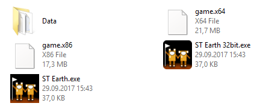

# How to make 32/64bit dual Windows build for a Unity game

It appears that it's possible to create one Unity Windows build that shares Data folder and can run either 32 and 64 bit version of the game. Depending on Unity version there are two ways to set this up.

## Before Unity 2017.1

Before Unity 2017.1 you need a small launcher that copies some files around before executing the game. [See instructions before 2017.1](INSTRUCTIONS_BEFORE_2017_1.md)

Build folder looks like this:

## After Unity 2017.1

Starting from Unity 2017.1 the launcher is not needed and no files need to be copied before running 32 or 64bit version of the game. [See instructions after 2017.1](INSTRUCTIONS.md)

Build folder looks like this:

